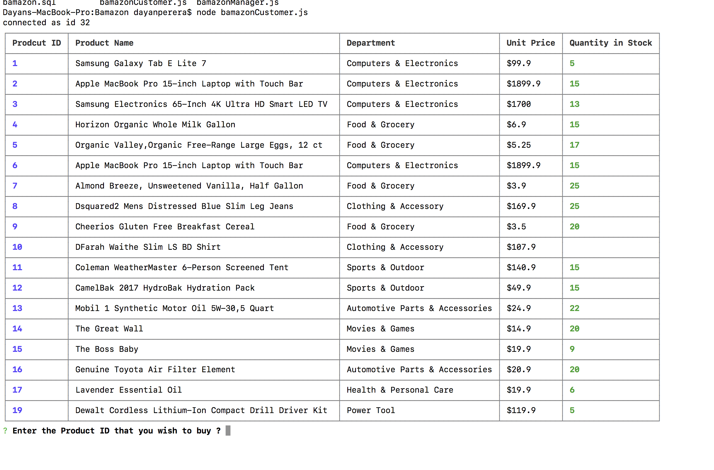
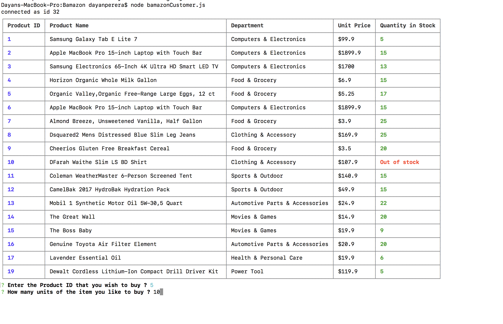
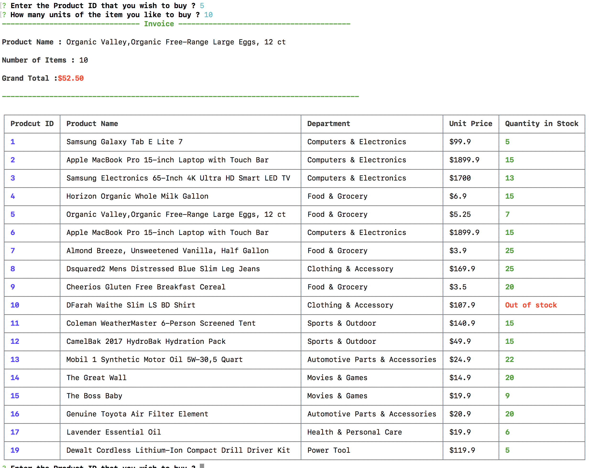
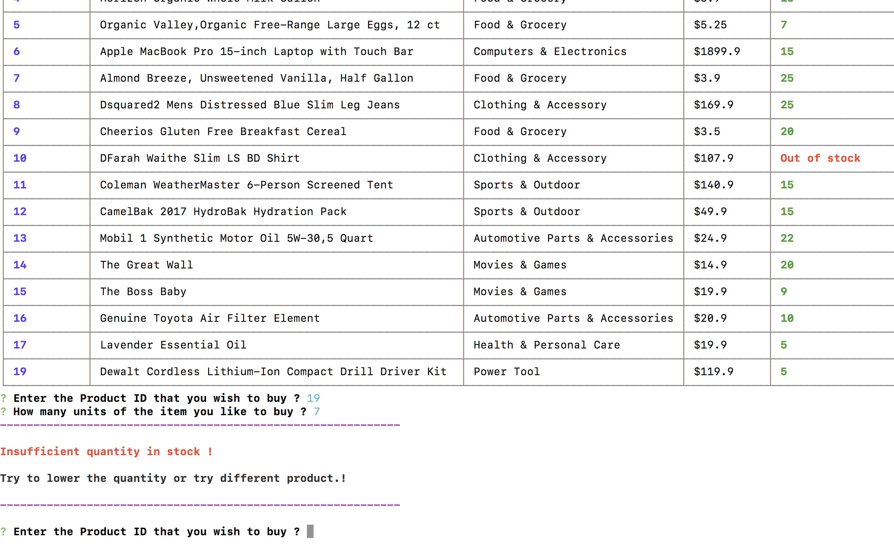
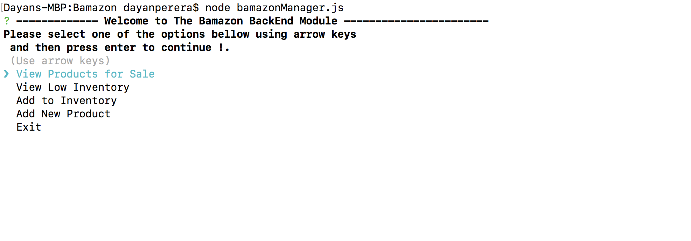
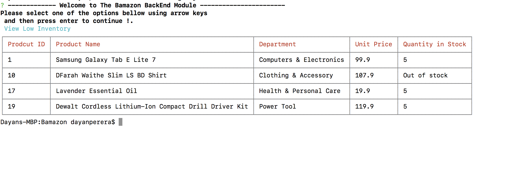
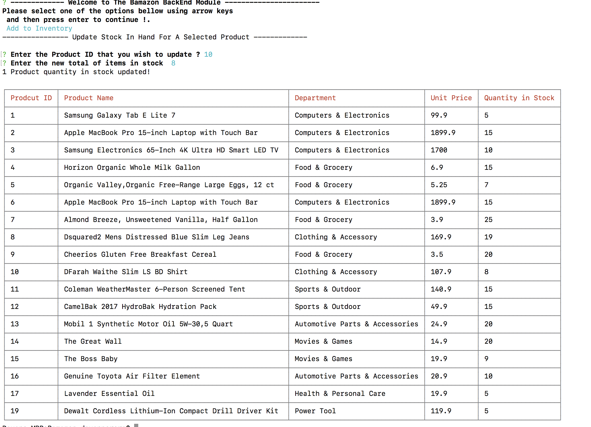
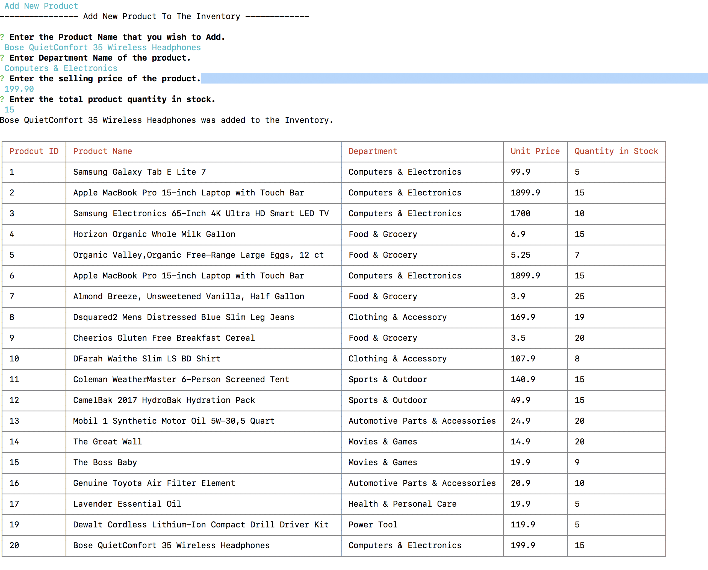

# Bamazon
This is terminal based simple shopping app developed using JavaScript Node framework and MYSQL.

## Functionality - Customer Version
**Start The App - type following command on your Terminal**

**node bamazonCustomer.js** 

**Once customer  run the app .Customer will be able to see most up to date list of items currently available .
Please refer to the following screenshot .**

;

**As you can see on the image .Customer will be asked to enter "Product ID" and quantity he likes to buy .
Customer needs to enter valid entry to proceed with purchase .**

;

**Once Customer enter valid values .Invoice will be displayed with updated inventory . Please refer to bellow image.**

;

**If the customer enter the quantity required higher than items in stock. "Insufficient Stock" message will be displayed.Also Customer can re-enter items required which will be less than or equal to items in stock. Please refer to following Image.**

;

## Functionality - Manager Version

**Start The App - type following command on your Terminal**

**node bamazonManager.js** 

**Once you run the app . You will see following options to select
View the inventory
View the items with low in stock
Update Stock Quantity
Add new product
Exit .Please refer to following screenshot.**

;

**View Low Inventory Items - In this option, App will display list of product who has got less than or equal to 5 in stocks.**

;

**Update Stock - in this option,user can enter the product id and enter the total items in stock currently in order to update .**

;

**Add New Product - User need to provide product name,department,sales price per item and no of items in stock. **
;

